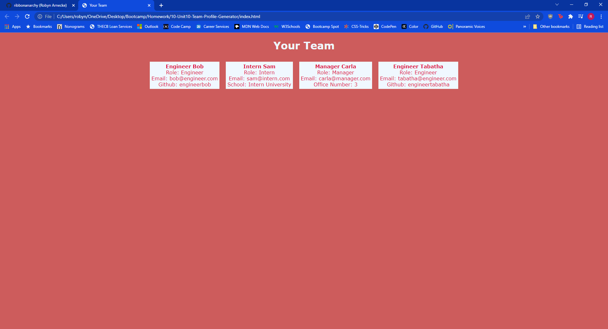

# Team Profile Generator

Title: Team Profile Generator    
Developer: Robyn Arnecke    

---

## Summary 

This application uses the Node Inquirer package to get user input that can be used in generating a webpage. The user is prompted for information on as many team members as they have, and when they are done a .html file is generate that displays a card for each member of the user's team. 

Here is a link to a video which portrays the application being used from start to finish: https://watch.screencastify.com/v/jvWK5qqCRY64zCv28U31

--- 

## Development

I started development by writing my different employee classes. Once those were in place, I moved on to making sure that the Node Inquirer package was running smoothly. Once I had the question answers populating my array of team employees, it was then about figuring out the best way for the string that was to be output to the HTML was formatted correctly. After the structure of the HTML was in place, I styled it with some simple CSS. Finally, once it was functioning fully, I wrote tests for each function using the Jest package and made sure that all of the tests pass. 

---

## Testing

To run the tests provided with this application, run the command `npm test` in the command line. 